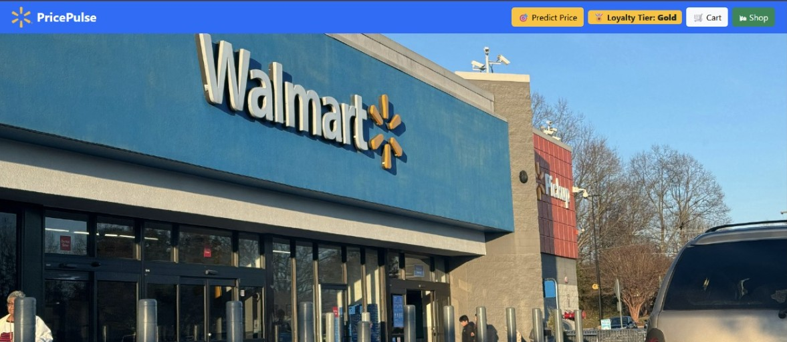

# PricePulse: Hyper-Personalized Dynamic Pricing Engine

**PricePulse** is a modular machine learning system that dynamically adjusts product prices in real time based on customer segments, context, and likelihood to purchase. Developed as part of the **Walmart A+ Sparkathon 2025**, this project demonstrates how targeted, data-driven incentives can drive both revenue and satisfaction.

## Project Demo

[](https://www.youtube.com/watch?v=IX_58bvUJ00)

This repository contains the complete backend pipeline, including data preprocessing, customer segmentation, conversion prediction, and personalized price optimization. Frontend visualizations were created separately by a teammate and are included for demonstration.

---

## Table of Contents
- [Problem Statement](#problem-statement)
- [Project Architecture](#project-architecture)
- [ML Pipeline](#ml-pipeline)
- [Datasets](#datasets)
- [Directory Structure](#directory-structure)
- [Setup & Installation](#setup--installation)
- [Future Improvements](#future-improvements)
- [License](#license)

---

## Problem Statement

> How can Walmart offer the right price to the right customer at the right time?

Most online retailers rely on static pricing, but customer behavior, demand, inventory, and context change constantly. PricePulse aims to solve this by generating **personalized, context-aware prices** that respond to user behavior and market conditions in real time.

---

## Project Architecture

[Customer Data]
↓
[Segmentation Model] → Assigns customer to behavioral cluster
↓
[Pricing Model] → Predicts optimal price based on features
↓
[Conversion Model] → Estimates likelihood of purchase at that price
↓
[Final Price Recommendation] → Sent to frontend/displayed to user

Optional reinforcement logic can be added later to refine pricing over time using feedback.

---

## ML Pipeline

### 1. Customer Segmentation (Clustering)
- Technique: KMeans
- Features: Recency, Frequency, LoyaltyTier, AvgSpend
- Output: Cluster label (e.g., "Premium", "Value Seeker")

### 2. Personalized Price Prediction (Regression)
- Technique: Gradient Boosting Regressor
- Inputs: Customer profile, product data, context
- Output: Suggested personalized price

### 3. Conversion Prediction (Classification)
- Technique: Classifier (e.g., Gradient Boosting, Logistic Regression)
- Inputs: Same as above + predicted price
- Output: Probability of purchase

Each step is modular and trained using engineered features for flexibility and clarity.

---

## Datasets

The following datasets were used during experimentation:

- `clustered_customers.csv`: Cleaned transactional data for clustering
- `segmented_customers.csv`: Output of the KMeans segmentation pipeline
- `final_model_ready.csv`: Complete feature-engineered dataset for pricing and classification models

Datasets were built using synthetic and open-source references from platforms like Kaggle.

---

## Directory Structure
<pre> . ├── data/ │ ├── raw/ │ └── processed/ │ └── final_model_ready.csv │ ├── models/ │ ├── gb_model.pkl │ ├── kmeans_model.pkl │ ├── segment_mapping.pkl │ ├── label_encoders.pkl │ └── scaler_segmentation_features.pkl │ ├── notebooks/ │ ├── SegmentationModel.ipynb │ ├── DynamicPricingFinal.ipynb │ └── ConversionFinalOne.ipynb │ ├── requirements.txt ├── LICENSE └── README.md </pre>


---

## Setup & Installation

### 1. Clone the repository
```bash
git clone https://github.com/yourusername/pricepulse.git
cd pricepulse
pip install -r requirements.txt
```
 ## Run the notebooks
Each step of the pipeline is available in the notebooks/ folder. You can open them in Jupyter or Google Colab to test segmentation, pricing, and classification independently.

## Future Improvements
Integrate reinforcement learning for continuous price adjustment based on conversion feedback

Add API interface using Flask or FastAPI for real-time inference

Extend pipeline to support live user sessions or frontend interaction

Enable automated A/B testing between price strategies

## License
This project is licensed under the MIT License.

## Acknowledgments
Developed as part of the Walmart A+ Sparkathon 2025

Backend and datasets developed by Lavanya Shree

Frontend UI created by a teammate and used here to demonstrate integration potential

Inspired by real-world dynamic pricing strategies.
